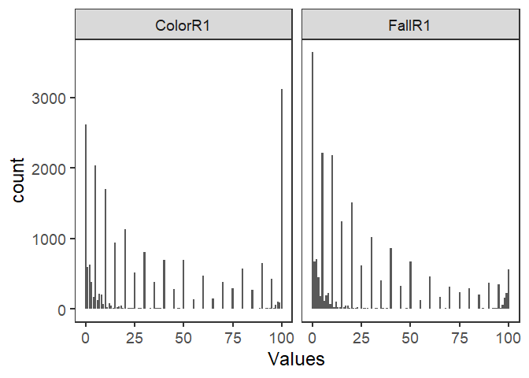
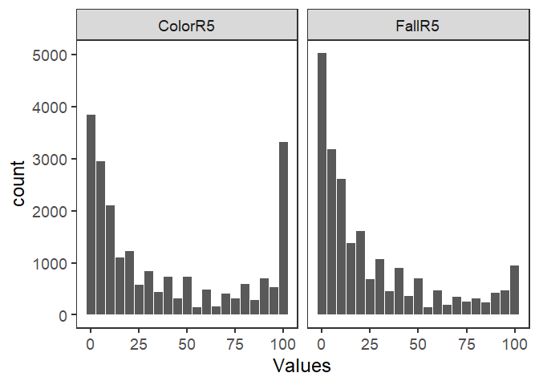
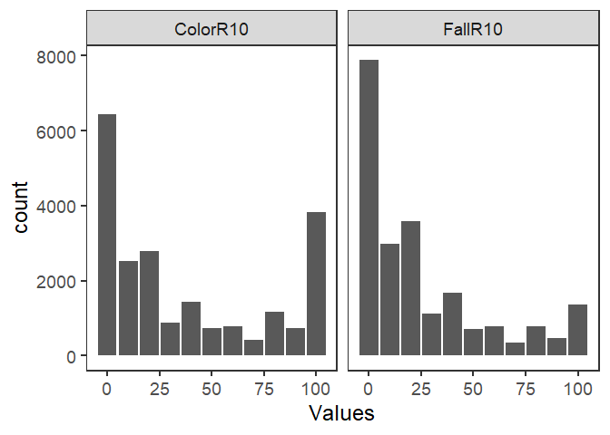

## Read in data

Note: This R file should be located in the same working directory as the data. Otherwise reading data from other places in the google drive is challenging and I couldn't get it to work. Might be tricky since the drive is "shared with me" not a shared drive or my drive.


```r
Data2017 <- read_csv('test_form5_2019_12_19_14_56_01_542496.csv')
Data2018 <- read_csv(
  'Form_BS162_2018_v2_2019_12_19_14_56_54_642030.csv')
Data2019 <- read_csv(
  'Form_BS162_2019_2019_12_19_14_57_47_271712.csv')
Data2021 <- read_xlsx(
  '2021Fall_TreePhenologyData_All_wPhotoLinks.xlsx')
```

## Merge data

### Merge 2017-2019


```r
Data171819 <- Data2017 %>% 
  bind_rows(Data2018) %>% 
  bind_rows(Data2019)
```

### Species columns 


```r
# Remove \n from the SPECIES column
Data2021 %<>% 
  mutate(SPECIES = str_remove(SPECIES, '\n'))

# Take a look at the two species columns
Data2021$SPECIES %>% table
```

```
## .
##                  Acer rubrum               Acer saccharum 
##                          593                          437 
##               Cornus florida  Fagus grandifolia/sylvatica 
##                          569                          492 
## Metasequoia glyptostroboides            Ostrya virginiana 
##                          349                          508 
##                Pinus strobus        Platanus occidentalis 
##                          390                          509 
##                 Quercus alba                Quercus rubra 
##                          433                          379 
##              Ulmus americana 
##                          605
```

```r
Data171819$species %>% table
```

```
## .
## ACRU ACSA COFL FAGR MEGL PIST PLOC QUAL QURU ULMA 
## 1606 1680 1747 1674 1610 1645 1690 1629 1677 1535
```

```r
# Create dataframe with both styles of species names
SpeciesLookUp <- tibble(
  SPECIES = unique(Data2021$SPECIES) %>% sort,
  species = c(unique(Data171819$species), 'OSVI') %>% sort)

# Add the species names to both spreadsheets
Data171819 %<>% 
  left_join(SpeciesLookUp)
Data2021 %<>% 
  left_join(SpeciesLookUp)
```

### Leaf color columns

Will probably want to round to the nearest 5% since most people did so.


```r
Data171819$color %>% table
```

```
## .
##    0    1    2    3    4    5    6    7    8    9   10   11   12   13   14   15 
## 1899  405  480  270  124 1620   97  173  140   48 1370   15   61   35    7  721 
##   16   17   18   19   20   21   22   23   24   25   26   27   28   29   30   31 
##   19   35   33    8  894    5   14   19    9  407    7    9    7    4  644    3 
##   32   33   34   35   36   37   38   39   40   42   43   44   45   46   47   48 
##    5   13    7  296   10   13    8    5  560    5    3    4  204    5   10   10 
##   49   50   51   52   53   54   55   56   57   58   59   60   62   63   65   67 
##    2  555    1    8    1    1  105    4    3    1    1  380    3    2  106    5 
##   68   69   70   72   73   74   75   76   77   78   80   82   83   84   85   86 
##    5    7  308    3    2    1  232    5    4    4  471    6    2    1  205    5 
##   87   88   89   90   91   92   93   94   95   96   97   98   99  100 
##    8    6    9  512    2   15    8    7  342   13   39   86   67 2200
```

```r
# ggplot(Data171819, aes(x = color)) +
#   geom_bar() + tbw + th
Data2021$`LEAF COLOR` %>% table
```

```
## .
##    0 0.01 0.03  0.1  0.3  0.5    1    2    3    4    5    6    7    8    9  9.5 
##  699    5    1    6    1    6  197  151  117   47  422   29   48   66   24    1 
##   10   11   12   13   14 14.5   15   16   17   18   19   20   21   22   23   24 
##  335   12   28   16   10    4  227   11    9   14    3  240    2    5    3    4 
##   25   27   28   29   30   31   32   33   34   35   36   37   38   39   40   41 
##  108    4    4    1  163    2    4    3    1   90    2    2    6    2  138    2 
##   42   43   44   45   47   48   49   50   51   52   53   55   56   57   58   60 
##    2    4    1   79    2    5    2  140    2    2    2   30    2    3    2   92 
##   62   63   64   65   68   70   72   73   75   76   78   79   80   81   82   83 
##    4    1    2   39    1   80    1    1   66    4    2    1  104    3    2    2 
##   85   87   88   89   90   91   92   93   94   95   96   97   98   99  100 
##   66    1    2    3  143    1    3    3    5   92    5   17   20   28  917
```

```r
# Note: bars barely show up due to 0.01 width
# ggplot(Data2021, aes(x = `LEAF COLOR`)) +
#   geom_bar() + tbw + th
```

### Leaf fall columns

I'm not sure how students found that a negative percent of leaves were falling. We can remove those three rows since we have replication and don't know what to do with them. There is also a lot of precision, 0.0001 recorded in 2021. We'll need to round those values.


```r
Data171819$fall %>% table
```

```
## .
##  -23   -9   -7    0    1    2    3    4    5    6    7    8    9   10   11   12 
##    1    1    1 2530  442  529  321  135 1742   78  151  166   47 1754   27   75 
##   13   14   15   16   17   18   19   20   21   22   23   24   25   26   27   28 
##   26   10  969   17   40   42    8 1228    8   14   21    5  497    8    8   12 
##   29   30   31   32   33   34   35   36   37   38   39   40   41   42   43   44 
##    5  821    3   13   10    5  325    7    6   13    7  696    3    7    5    8 
##   45   46   47   48   49   50   52   54   55   56   57   58   60   62   63   65 
##  259    5    4    5    3  541    2    1  110    5    5    3  362    1    3  148 
##   67   68   69   70   72   73   75   76   77   78   79   80   81   82   83   84 
##    5   10    6  254    2    3  188    3    1    5    4  239    1    6    1    3 
##   85   86   87   88   89   90   91   92   93   94   95   96   97   98   99  100 
##  167    6    8    5    6  298    4   11   17    9  266   15   45  113  155  333
```

```r
Data2021$`LEAF FALL` %>% table
```

```
## .
##     0 1e-04  0.01  0.02  0.03   0.1   0.2  0.25   0.3   0.5     1     2     3 
##  1093     1     5     1     1     3     1     1     1     8   233   181   134 
##     4     5   5.5     6     7     8     9    10    11    12    13    14    15 
##    48   478     1    41    46    58    24   425     6    26     7    18   272 
##    16  16.5    17    18    19    20  20.5    21    22    23    24    25    26 
##     6     1    15    13     6   283     1     5     5     6     3   125     8 
##    27    28    29    30    31    32    33    34    35    36    37    38    39 
##     5     4     1   202     1     4     6     2    82     7     4     6     2 
##    40    42    43    45    46    48    49    50    51    55    56    57    58 
##   171     3     5    66     2     7     1   139     2    19     2     2     1 
##    60    64    65    66    67    68    70    71    73    74    75    76    77 
##   102     1    29     4     1     1    67     1     1     2    52     2     2 
##    78    79    80    82    83    84    85    86    87    88    89    90    91 
##     3     1    56     3     2     1    40     1     3     3     2    80     2 
##    92    93    94    95    96    97    98    99  99.5  99.7  99.8  99.9   100 
##     6     5     6    80     6    15    48    69     1     1     1     6   222
```

### Accession number columns

140 trees are in both datasets. 36 trees are only in one dataset.


```r
# Most individual/ACCESSION values are in both dataframes
unique(Data171819$individual) %in% 
  unique(Data2021$ACCESSION) %>%
  table
```

```
## .
## FALSE  TRUE 
##    13   140
```

```r
unique(Data2021$ACCESSION) %in% 
  unique(Data171819$individual) %>%
  table
```

```
## .
## FALSE  TRUE 
##    23   140
```

```r
# Look at the values that are NOT in both data frames
unique(Data171819$individual)[!unique(Data171819$individual) %in% 
  unique(Data2021$ACCESSION)]
```

```
##  [1] "CC0192*01"   "CC6694*01"   "CC4600*01"   "20100048*06" "CC4955*04"  
##  [6] "CC6500*01"   "20100048*10" "CC6694*02"   "CC4948*01"   "CC6284*01"  
## [11] "CC6392*01"   "CC6248*01"   "CC4636*01"
```

```r
unique(Data2021$ACCESSION)[!unique(Data2021$ACCESSION) %in% 
  unique(Data171819$individual)]
```

```
##  [1] "20090257*06" "20070191*01" "20090257*03" "20090257*04" "20070191*02"
##  [6] "20110263*01" "20090257*07" "CC9244*01"   "20070191*04" "CC5484*05"  
## [11] "CC5484*04"   "CC5484*03"   "20090303*05" "CC1719*02"   "20070191*03"
## [16] "CC5899*02"   "CC1719*01"   "CC6546*02"   "CC7298*02"   "CC1648*01"  
## [21] "20090257*02" "CC1320*01"   "20090257*01"
```

### Photo links


```r
Data171819$photo %>% head
```

```
## [1] "DSC_0338-13_39_59.JPG"                        
## [2] "IMG_2539-11_25_35.JPG"                        
## [3] "15051398401781007342641169183082-10_24_12.jpg"
## [4] "IMG_2537-11_27_32.JPG"                        
## [5] "image-11_58_28.jpg"                           
## [6] "image-12_0_31.jpg"
```

```r
Data2021$`PICTURE ADDRESS` %>% head
```

```
## [1] "https://michiganstate-my.sharepoint.com/personal/huntseth_msu_edu/Documents/Apps/Microsoft%20Forms/21F%20BS-162-001002%20Tree%20Phenology%20Project%20Data%20Coll/Question/IMG_20210917_111319435_HDR_Aaron%20Brookhouse.jpg"
## [2] "https://michiganstate-my.sharepoint.com/personal/huntseth_msu_edu/Documents/Apps/Microsoft%20Forms/21F%20BS-162-001002%20Tree%20Phenology%20Project%20Data%20Coll/Question/IMG_20210917_111529196_Aaron%20Brookhouse.jpg"    
## [3] "https://michiganstate-my.sharepoint.com/personal/huntseth_msu_edu/Documents/Apps/Microsoft%20Forms/21F%20BS-162-001002%20Tree%20Phenology%20Project%20Data%20Coll/Question/IMG_20210924_100353881_HDR_Aaron%20Brookhouse.jpg"
## [4] "https://michiganstate-my.sharepoint.com/personal/huntseth_msu_edu/Documents/Apps/Microsoft%20Forms/21F%20BS-162-001002%20Tree%20Phenology%20Project%20Data%20Coll/Question/IMG_20210924_100253328_HDR_Aaron%20Brookhouse.jpg"
## [5] "https://michiganstate-my.sharepoint.com/personal/huntseth_msu_edu/Documents/Apps/Microsoft%20Forms/21F%20BS-162-001002%20Tree%20Phenology%20Project%20Data%20Coll/Question/IMG_20211001_101600407_Aaron%20Brookhouse.jpg"    
## [6] "https://michiganstate-my.sharepoint.com/personal/huntseth_msu_edu/Documents/Apps/Microsoft%20Forms/21F%20BS-162-001002%20Tree%20Phenology%20Project%20Data%20Coll/Question/IMG_20211001_101725039_Aaron%20Brookhouse.jpg"
```


### Rename columns as needed


```r
# Rename columns
Data171819 %<>% 
  rename(DATE = `_submission_time`)

Data2021 %<>%
  rename(color = `LEAF COLOR`,
         fall = `LEAF FALL`,
         individual = ACCESSION,
         photo = `PICTURE ADDRESS`)
```

### Add lat, long, altitude to 2021 data

Tried to do this, but it resulted in almost 500,000 rows of data due to rows of data with multiple lat/long/alt datasets. The problem is not just the altitude data, as removing that column doesn't help much.


```r
Data2021 %>% 
  left_join(Data171819[,c('individual', '_tree_gps_latitude',
                         '_tree_gps_longitude', 
                         '_tree_gps_altitude')]) %>% dim
```

```
## [1] 487382     10
```

```r
Data2021 %>% 
  left_join(Data171819[,c('individual', '_tree_gps_latitude',
                         '_tree_gps_longitude')]) %>% dim
```

```
## [1] 487382      9
```


### Merge select columns


```r
# Currently including group_num and student_id in case we want to use them as random effects. We don't have them for all years though
AllData <- Data171819[,c('SPECIES', 'species', 'individual',
                         'color', 'fall', 'DATE',
                         "_tree_gps_latitude",
                         '_tree_gps_longitude',
                         '_tree_gps_altitude',
                         'group_num', 'student_id',
                         'photo')] %>% 
  bind_rows(Data2021[,c('SPECIES', 'species', 'individual',
                        'color', 'fall', 'DATE',
                        # "_tree_gps_latitude",
                        # '_tree_gps_longitude',
                        # '_tree_gps_altitude',
                        'photo')])

# Rename lat/long/altitude for ease
AllData %<>% rename(Latitude = '_tree_gps_latitude',
                    Longitude = '_tree_gps_longitude',
                    Altitude = '_tree_gps_altitude')
```


## Remove questionable data


```r
# Negative % leaf fall
AllData %>% 
  filter(color < 0 |
         fall < 0)
```

```
## # A tibble: 3 x 12
##   SPECIES  species individual color  fall DATE                Latitude Longitude
##   <chr>    <chr>   <chr>      <dbl> <dbl> <dttm>                 <dbl>     <dbl>
## 1 Quercus~ QUAL    CC1059*01      7    -9 2017-09-24 16:12:43     42.7     -84.5
## 2 Platanu~ PLOC    CC0016*01      1   -23 2017-10-01 16:14:57     42.7     -84.5
## 3 Acer sa~ ACSA    CC6259*02      3    -7 2019-09-10 17:04:38     42.7     -84.5
## # ... with 4 more variables: Altitude <dbl>, group_num <dbl>, student_id <chr>,
## #   photo <chr>
```

```r
# Remove negatives
AllData %<>% 
  filter(color >= 0,
         fall >= 0)
```

## Round leaf color and leaf fall data


```r
AllData %<>% 
  mutate(ColorR1 = round(color, digits = 0),
         ColorR5 = round(color / 5, digits = 0) * 5,
         ColorR10 = round(color, digits = -1),
         FallR1 = round(fall, digits = 0),
         FallR5 = round(fall / 5, digits = 0) * 5,
         FallR10 = round(fall, digits = -1))
AllData %>% 
  select(color, ColorR1, ColorR5, ColorR10, 
         fall, FallR1, FallR5, FallR10) %>% 
  unique %>% 
  head(20)
```

```
## # A tibble: 20 x 8
##    color ColorR1 ColorR5 ColorR10  fall FallR1 FallR5 FallR10
##    <dbl>   <dbl>   <dbl>    <dbl> <dbl>  <dbl>  <dbl>   <dbl>
##  1    20      20      20       20     0      0      0       0
##  2     5       5       5        0     0      0      0       0
##  3    80      80      80       80     0      0      0       0
##  4    10      10      10       10     5      5      5       0
##  5     2       2       0        0     0      0      0       0
##  6     0       0       0        0     0      0      0       0
##  7     5       5       5        0     1      1      0       0
##  8    15      15      15       20    10     10     10      10
##  9    10      10      10       10     0      0      0       0
## 10    50      50      50       50     0      0      0       0
## 11    15      15      15       20     0      0      0       0
## 12     7       7       5       10     0      0      0       0
## 13    30      30      30       30     0      0      0       0
## 14    70      70      70       70     0      0      0       0
## 15     0       0       0        0    10     10     10      10
## 16     5       5       5        0     5      5      5       0
## 17    10      10      10       10    10     10     10      10
## 18    75      75      75       80     0      0      0       0
## 19     0       0       0        0    15     15     15      20
## 20     1       1       0        0     0      0      0       0
```

### Visualize

People seemed to naturally round to 5% in many cases, and somewhat to 10% as well. May want to use these smoothed values, though might not be necessary.


```r
ForPlot <- AllData %>% 
  pivot_longer(cols = c(ColorR1, ColorR5, ColorR10,
                        FallR1, FallR5, FallR10),
               names_to = 'Metric', values_to = 'Values')
ggplot(ForPlot %>% filter(Metric %in% c('ColorR1', 'FallR1')), 
       aes(x = Values)) +
  geom_bar() + 
  tbw + th + 
  facet_wrap(~ Metric)
```

<!-- -->

```r
ggplot(ForPlot %>% filter(Metric %in% c('ColorR5', 'FallR5')), 
       aes(x = Values)) +
  geom_bar() + 
  tbw + th + 
  facet_wrap(~ Metric)
```

<!-- -->

```r
ggplot(ForPlot %>% filter(Metric %in% c('ColorR10', 'FallR10')), 
       aes(x = Values)) +
  geom_bar() + 
  tbw + th + 
  facet_wrap(~ Metric)
```

<!-- -->

## Date information

Extract date (YMD). Columns for year, month, day, week


```r
AllData %<>% 
  mutate(Year = year(DATE),
         Month = month(DATE),
         Day = day(DATE),
         Week = week(DATE))

AllData %>% 
  select(DATE, Year, Month, Day, Week) %>% 
  unique %>% 
  tail
```

```
## # A tibble: 6 x 5
##   DATE                 Year Month   Day  Week
##   <dttm>              <dbl> <dbl> <int> <dbl>
## 1 2021-11-24 00:00:00  2021    11    24    47
## 2 2021-09-01 00:00:00  2021     9     1    35
## 3 2021-11-25 00:00:00  2021    11    25    47
## 4 2021-09-03 00:00:00  2021     9     3    36
## 5 2021-12-22 00:00:00  2021    12    22    51
## 6 2021-12-12 00:00:00  2021    12    12    50
```

## Unique observer


```r
# We have group_num and student_id for some sets of data. Not sure it'll be useful since we don't have them for everything. If needed though, here's a unique group_num/student_id/year variable
AllData %<>% 
  mutate(UniqueGroup = paste(Year, group_num, sep = "_"),
         UniqueStudent = paste(Year, group_num, student_id, 
                               sep = "_"))
```


## Export cleaned data


```r
# Commented out since it's already run.
# Uncomment if needed to re-export.
# write.csv(AllData, file = 'CleanedPhenologyData2017to2021.csv',
#           row.names = FALSE)
```

